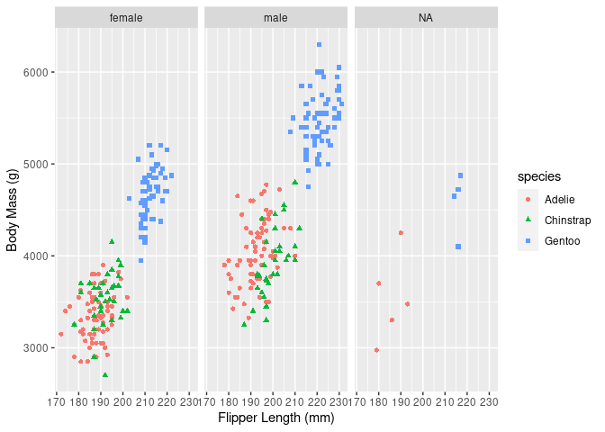

Palmer Penguins Report
================
Rifaldi Iqbal
2022-05-22

## Setting Up Environment

Notes : setting up my R environment by loading the ‘tidyverse’ and
‘palmerpenguins’ packages.

``` r
library(tidyverse)
#> ── Attaching packages ─────────────────────────────────────── tidyverse 1.3.1 ──
#> ✔ ggplot2 3.3.6     ✔ purrr   0.3.4
#> ✔ tibble  3.1.7     ✔ dplyr   1.0.9
#> ✔ tidyr   1.2.0     ✔ stringr 1.4.0
#> ✔ readr   2.1.2     ✔ forcats 0.5.1
#> ── Conflicts ────────────────────────────────────────── tidyverse_conflicts() ──
#> ✖ dplyr::filter() masks stats::filter()
#> ✖ dplyr::lag()    masks stats::lag()
library(palmerpenguins)
```

## Visualization

Here we will go through a series of visualization

### Flipper and body mass in purple

Here we plot flipper length against body mass

``` r
ggplot(data = penguins) + 
  geom_point(mapping = aes(x = flipper_length_mm, y = body_mass_g), color = 'blue') +
  geom_smooth(mapping = aes(x = flipper_length_mm, y = body_mass_g)) +
  xlab("Flipper Length (mm)") +
  ylab("Body Mass (g)")
```

<!-- -->

### Flipper and body mass by species

Here, we plot flipper length against body mass and look at the breakdown
by species

``` r
ggplot(data=penguins,aes(x=flipper_length_mm,y=body_mass_g))+
geom_point(aes(shape=species,color=species)) +
  geom_smooth(mapping = aes(x = flipper_length_mm, y = body_mass_g)) +
  xlab("Flipper Length (mm)") +
  ylab("Body Mass (g)")
```

<!-- -->

### Flipper and body mass by species and sex

Here, we plot flipper length against body mass and look at the breakdown
by species and sex

``` r
ggplot(data=penguins,aes(x=flipper_length_mm,y=body_mass_g))+
geom_point(aes(color=species,
               shape=species)) +
xlab("Flipper Length (mm)") +
ylab("Body Mass (g)") + 
facet_wrap(~sex)
```

<!-- -->
